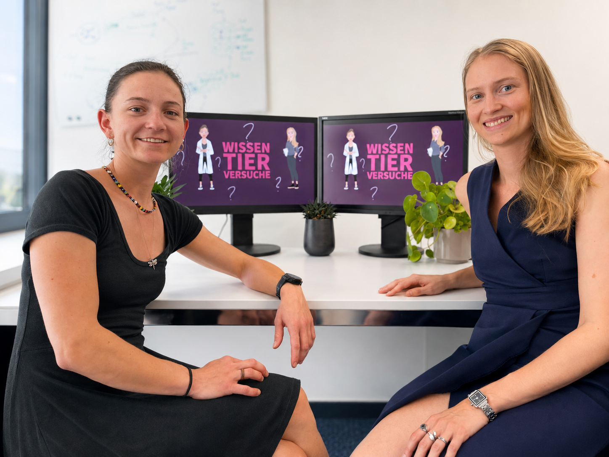

Wir sind Simona Doneva und Tosca Dalessi. Während unserer Promotionen an der Universität Zürich (UZH) beschäftigten wir uns intensiv mit den Themen Forschung mit Tieren, Wissenschaftskommunikation und dem Dialog zwischen Wissenschaft und Gesellschaft.

Aus diesem Interesse heraus entstand die Idee für die Videoserie *«Forschung mit Tieren in der Schweiz»*. Unser Ziel ist es, wissenschaftliche Informationen verständlich aufzubereiten und Fragen aus der Bevölkerung direkt von Forschenden beantworten zu lassen.

## Projektleitung
- **Tosca Dalessi**
- **Simona Doneva**

::: {.about-image}
{fig-alt="Simona Doneva und Tosca Dalessi"}
:::

## Unterstützende Stellen

Dieses Projekt wurde unterstützt und begleitet durch:

- Prorektorat Forschung (UZH)
- Abteilung 3R & Tierwohl (UZH)
- Abteilung Kommunikation (UZH)
- Multimedia & E-Learning Services (UZH)
- Life Science Zurich

## Kontakt

Bei Fragen oder Anregungen freuen wir uns über Ihre Kontaktaufnahme.

Kontakt: [E-Mail anzeigen](mailto:wissen.tierversuche@ik.me)