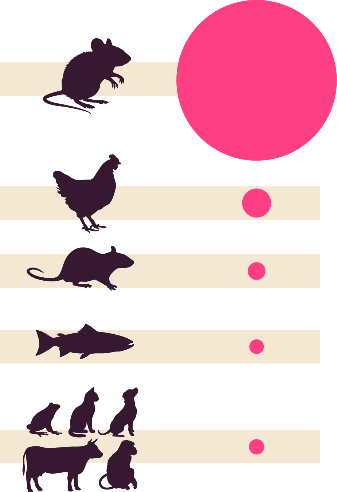
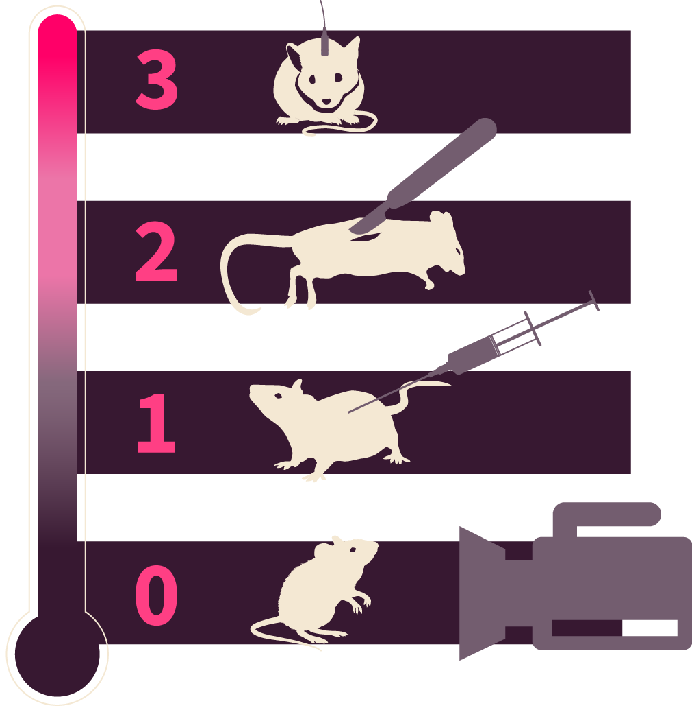
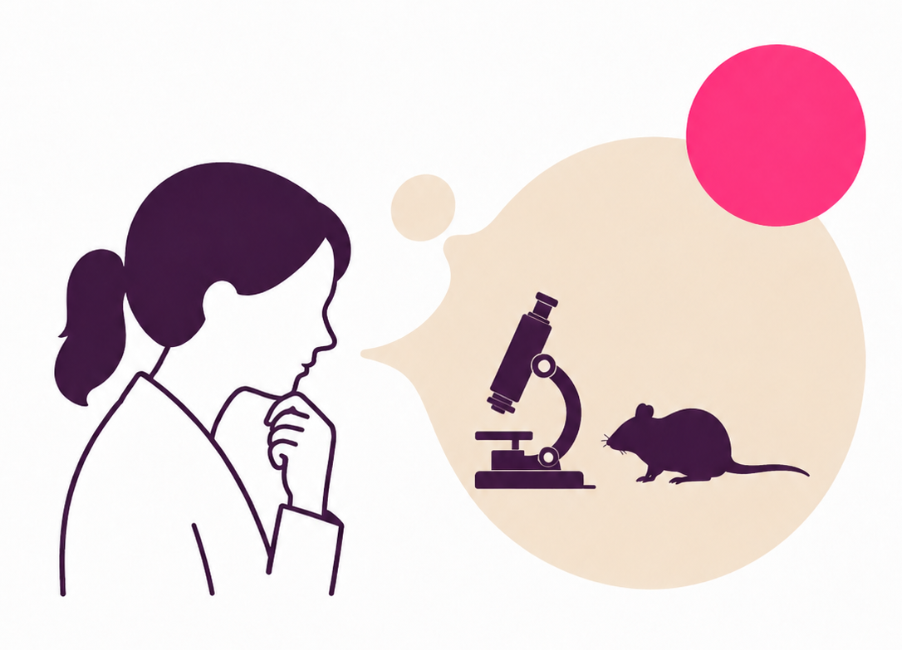
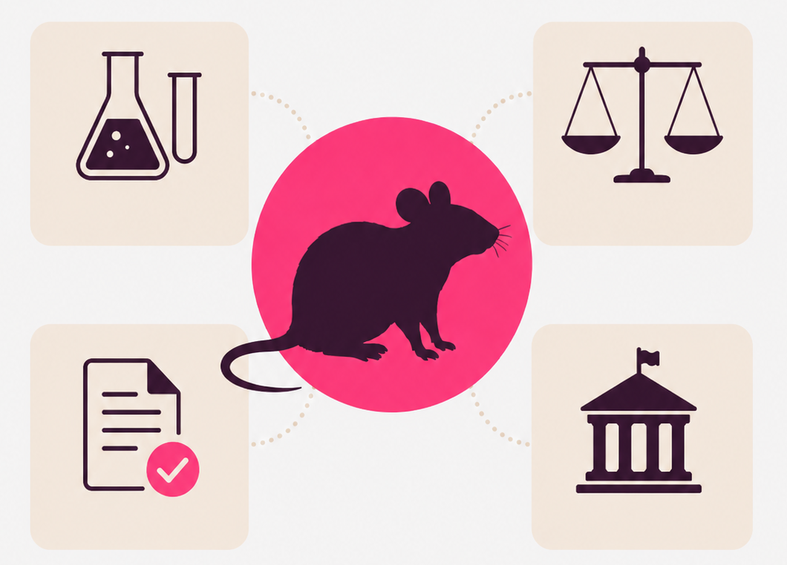
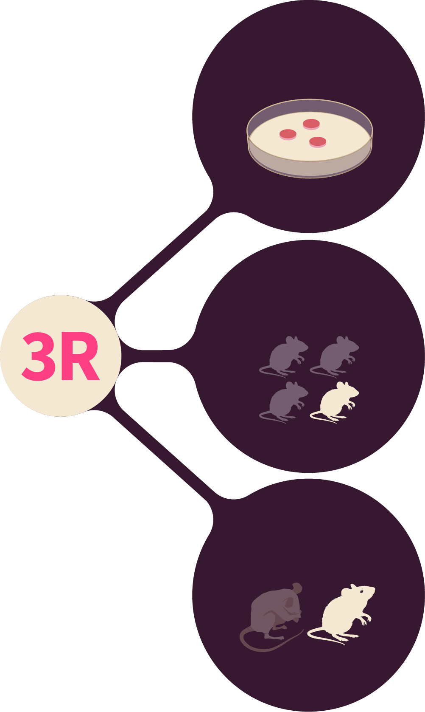

Die Serie ist in fünf zentrale Themen gegliedert. 

::: {.topic-list}

::: {.topic-card}
{.topic-thumb fig-alt=""}

::: {.topic-text}
[Tierversuche – einfach erklärt](01-explained.qmd)

Welche Tierarten werden verwendet und welche Vorschriften gelten für Tierversuche in der Schweiz? Live
:::
:::

::: {.topic-card}
{.topic-thumb fig-alt=""}

::: {.topic-text}
[Tierversuche – was sie für Tiere bedeuten](02-wellbeing.qmd)

Wie werden Tiere gehalten, geschützt und überwacht? Live
:::
:::

::: {.topic-card}
{.topic-thumb fig-alt=""}

::: {.topic-text}
[Tierversuche – wie Forschende darüber denken](03-researchers-view.qmd)

Wie gehen Forschende persönlich mit Tierversuchen um? Coming soon
:::
:::

::: {.topic-card}
{.topic-thumb fig-alt=""}

::: {.topic-text}
[Tierversuche – warum sie uns alle betreffen](04-ethical.qmd)

Zu welchen Zwecken sind Tierversuche erlaubt und wie werden sie bewilligt? Coming soon
:::
:::

::: {.topic-card}
{.topic-thumb fig-alt=""}

::: {.topic-text}
[Tierversuche – und ihre Alternativen](05-alternatives.qmd)

Welche Alternativen zu Tierversuchen gibt es? Coming soon
:::
:::

:::